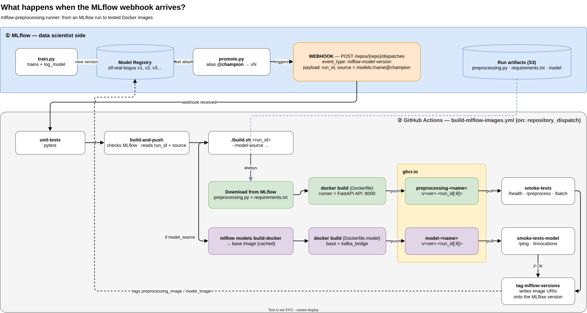
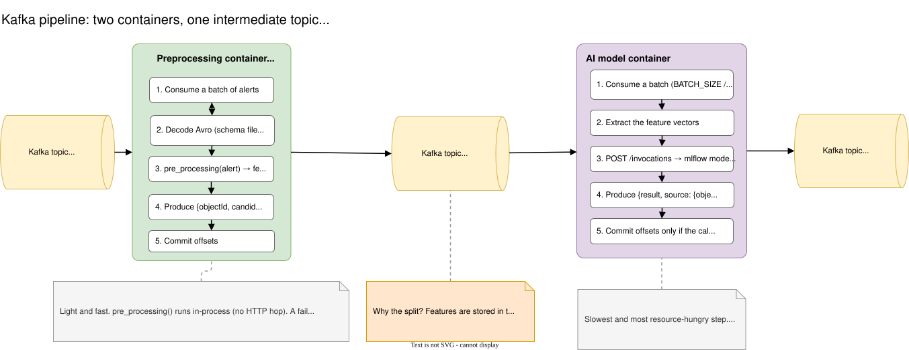

# MLflow Preprocessing Runner

Starting from an MLflow run, this service automatically builds **the two containers** a model needs to process Fink / ZTF alerts:

- **the preprocessing container** (or *data processing*): turns a raw alert into a feature vector, using the `preprocessing.py` logged in MLflow;
- **the AI model container**: computes the prediction from those features (`mlflow models serve`).

📖 **Technical documentation: <https://farid841.github.io/pre_processing-container-generator-from-mlflow/>**

## Why two separate containers?

- **No recomputation on failure.** The features produced by the preprocessing are stored in an intermediate Kafka topic. If the model fails, the features are replayed from that topic, without running the preprocessing again.
- **The model is the slowest and most resource-hungry step.** Kept separate, it can be sized and scaled independently of the preprocessing, which is light and fast.

## What happens when the MLflow webhook arrives



1. `training/promote.py` sets the `@champion` alias on a model version in MLflow, then sends the webhook (`repository_dispatch`) to GitHub.
2. The `build-mlflow-images.yml` workflow runs the unit tests, then `./build.sh`:
   - **always**: downloads `preprocessing.py` and `requirements.txt` from MLflow and builds the `preprocessing-<name>` image;
   - **if a model is provided**: `mlflow models build-docker`, then adds the Kafka bridge → `model-<name>` image.
3. Both images are pushed to `ghcr.io`, then tested (smoke tests).
4. If the tests pass, the image URIs are written as tags on the MLflow version.

## The Kafka pipeline



1. **Input**: ZTF alerts arrive as Avro in a topic (e.g. `fink_alerts`).
2. **Preprocessing container**: consumes a batch of alerts, decodes the Avro and drops the cutouts, calls `pre_processing(alert)`, produces `{objectId, candid, features}` as JSON to the intermediate topic, then commits the offsets.
3. **Intermediate topic** (e.g. `<name>-preprocessed`): keeps the features that are already computed.
4. **Model container**: consumes a batch of features, calls `POST /invocations` on the MLflow server, produces `{result, source}` to the output topic, and commits the offsets **only if the call succeeded**.
5. **Output**: the predictions (e.g. `<name>-results`).

## Quick start

```bash
pip install pdm && pdm install -G build
export MLFLOW_TRACKING_URI="https://mlflow.example.org"

./build.sh <run_id> --model-source models:/<name>@champion
```

The preprocessing contract, build options, Kafka environment variables and CI are covered in the [documentation](https://farid841.github.io/pre_processing-container-generator-from-mlflow/). Its sources are in `documentation/` (run `zensical serve` to preview them).

## Next steps

- [ ] **Measure execution times**: write performance tests for the preprocessing time per alert, the model time per batch and the end-to-end throughput (alerts/s). Goal: confirm where the bottleneck is and size each container.
- [ ] **Make model error recovery reliable**: today, if a batch fails and the next one succeeds, the second commit moves past the first, which is therefore never replayed. The batch should be retried before moving on, and messages that still fail should go to the dead letter queue (`DEAD_LETTER_TOPIC` is already configurable but never used).
- [ ] **Create a separate template repo** for people who want to use the service. It will contain a skeleton `preprocessing.py` that follows the contract, a `requirements.txt`, a training script that logs everything to MLflow, the contract tests and the promotion command. Users only have to fill in their logic, then promote their version.
